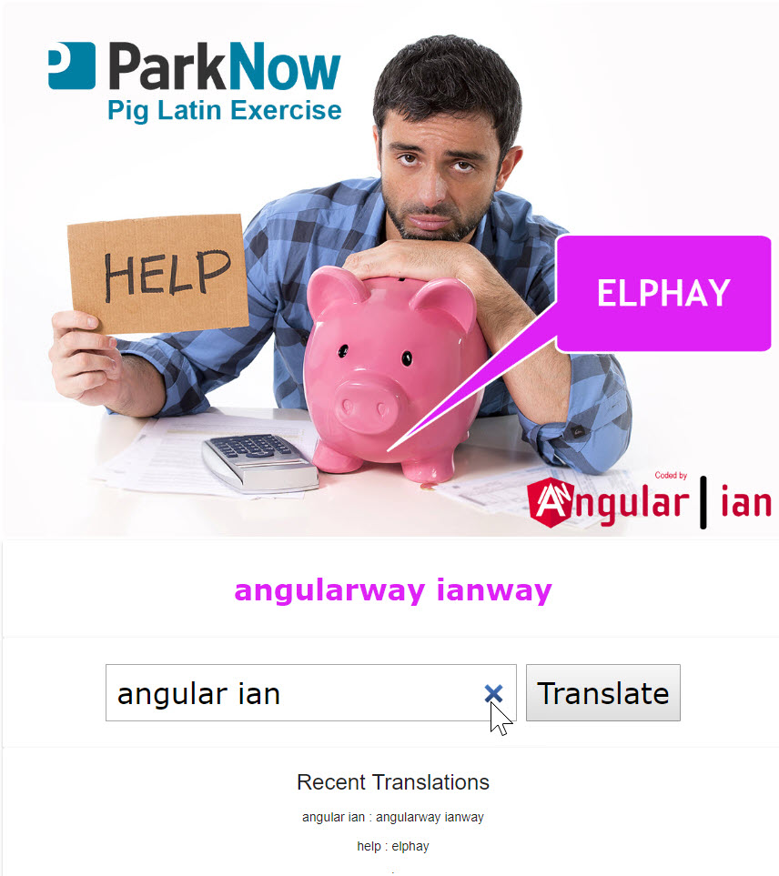
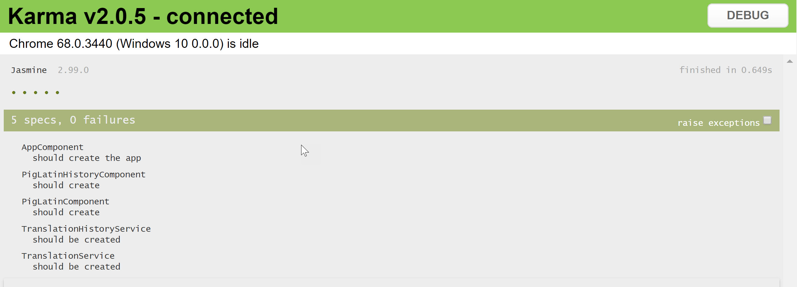
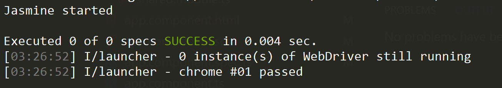
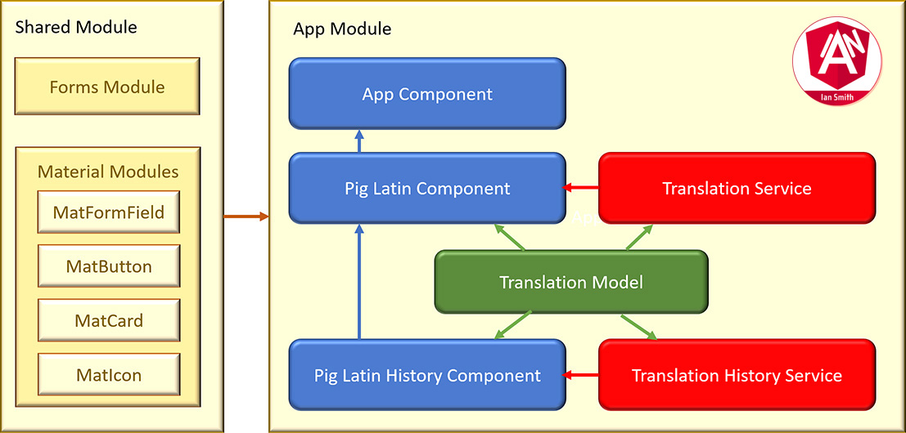

# Parknow Pig Latin Exercise

THIS IS AN EARLY WORK-IN-PROGRESS AND NOT READY FOR PUBLIC CONSUMPTION OR TESTING YET!

## About this Exercise

This is a Pig Latin converter. For more information on Pig Latin check [Wikipedia](https://en.wikipedia.org/wiki/Pig_Latin)

## Demo

You can run the demo of this code here on [Github Pages](https://AngularianUK.github.io/parknow-pig-latin)

In truth, Angular is overkill for a small converter like this, but as a requirement for a programming interview this code implements the converter, demonstrating the following features of Angular:

- Angular Material components for the UI including custom Angular Material theming
- parent and child components for the main translator and recent history to demonstrate inter-component communication
- Angular injected service instances to keep the components lightweight

The project does not use Redux (ngRx) - the author's preferred pattern for Enterprise apps - as that seemed overkill!

## Getting Started

`git clone https://github.com/AngularianUK/PigLatin.git pig-latin`

`cd pig-latin`

`npm install`

`npm start`

## Build

Run `ng build` to build the project. The build artifacts will be stored in the `dist/` directory. Use the `--prod` flag for a production build.

## Running automated tests

### Running Unit Tests

FULL SUITE OF UNIT TESTS COMING SOON!

Run `npm test` to execute the unit tests via [Karma](https://karma-runner.github.io)

### Running end-to-end tests

COMING SOON!

Run `npm run e2e` to execute the end-to-end tests via [Protractor](http://www.protractortest.org/)

## Marchitecture Diagram

